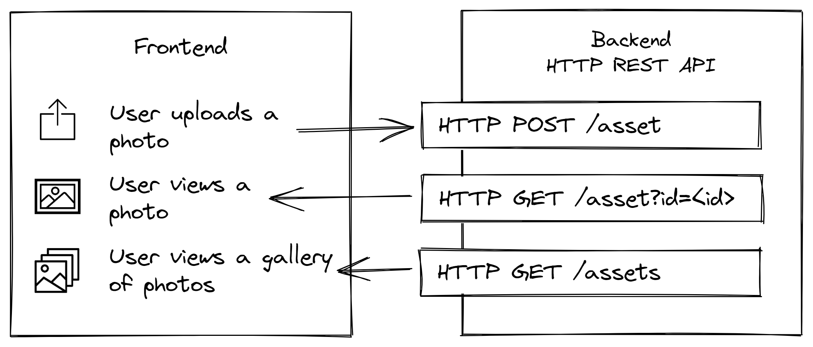

# Photosphere Node.js monolithic backend

This is the backend for [the Photosphere application](https://rapidfullstackdevelopment.com/example-application). It is a REST API to upload and retrieve assets like photos and videos.

This code accompanies chapter 2 of the book [Rapid Fullstack Development](https://rapidfullstackdevelopment.com/).

Follow the author on [Twitter](https://twitter.com/codecapers) for updates.



## Pre-reqs

You need [Node.js](https://nodejs.org/en/) installed to run this code.

## Setup

Clone a local copy of the code repository:

```bash
git clone git@github.com:Rapid-Fullstack-Development/photosphere-monolithic-backend.git
```

Open a terminal and change directory into your local copy:

```bash
cd photosphere-monolithic-backend
```

Install dependencies:

```bash
npm install
```

## Run it in development

Start the application in development mode with an instant dev database ([insta-mongo](https://www.npmjs.com/package/insta-mongo)) and live reload:

```bash
npm run start:dev
```

## Test the REST API

Install [VS Code REST Client](https://marketplace.visualstudio.com/items?itemName=humao.rest-client) and you can use the HTTP request scripts in `./test/backend.http` to test the endpoints in the REST API.

## Run in production

To run in production you will need a MongoDB database running.

The app will default by connecting to a local database on `mongodb://localhost:27017`.

You can connect to a different database (e.g. a MongoDB instance in the cloud) by setting this environment variable:

```bash
export DB_CONNECTION_STRING=<your db connection string>
```

Or on Windows:

```bash
set DB_CONNECTION_STRING=<your db connection string>
```

Start the application in production mode:

```bash
npm start
```

